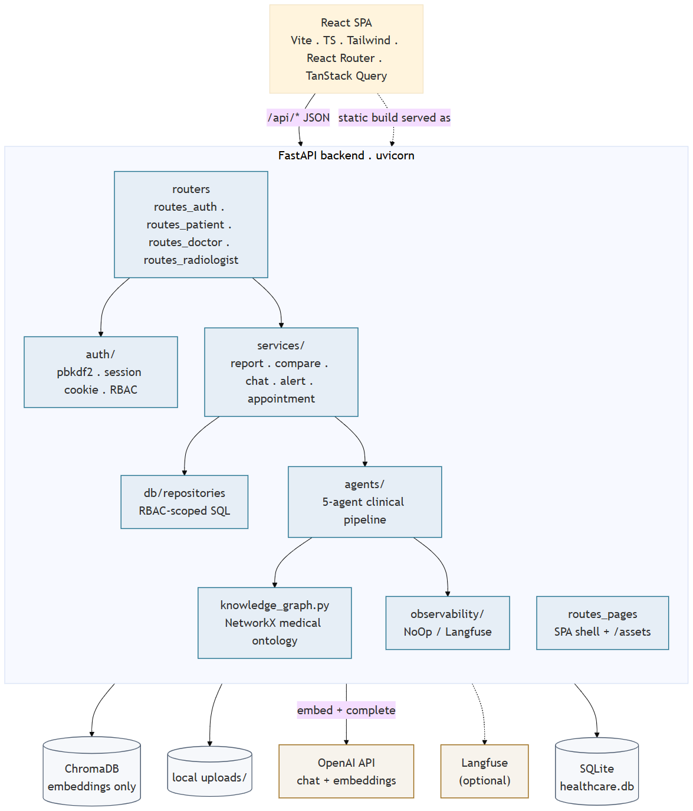
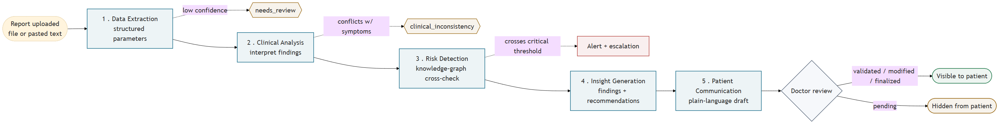
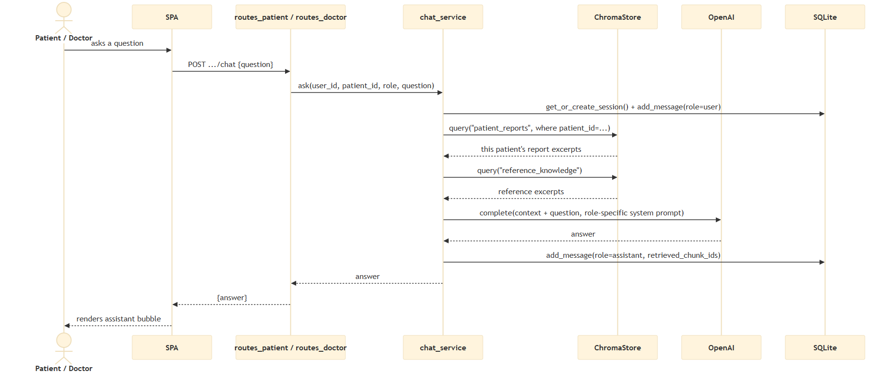
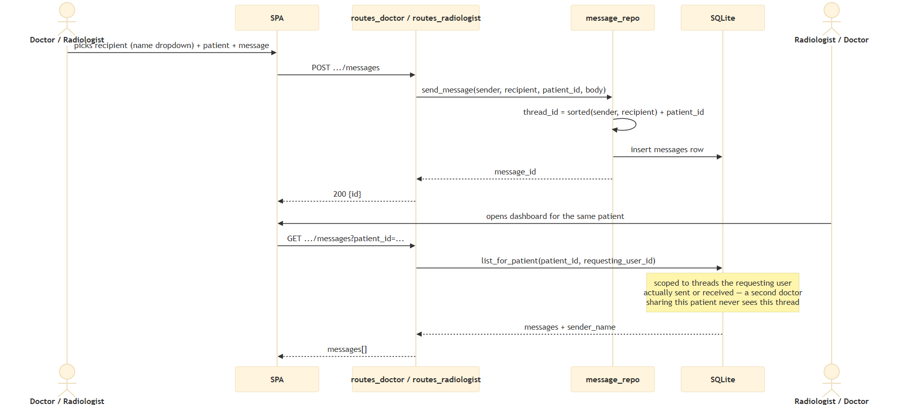
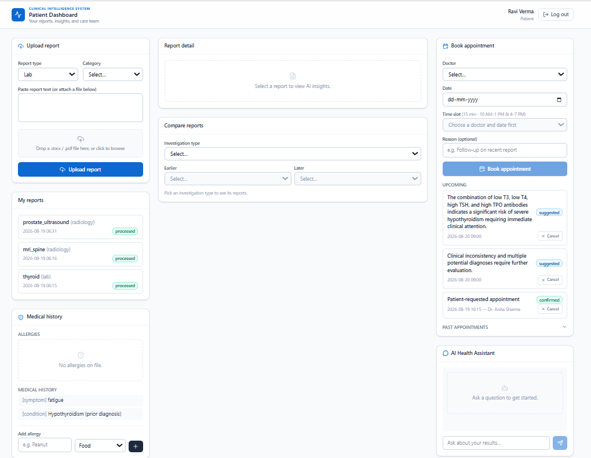
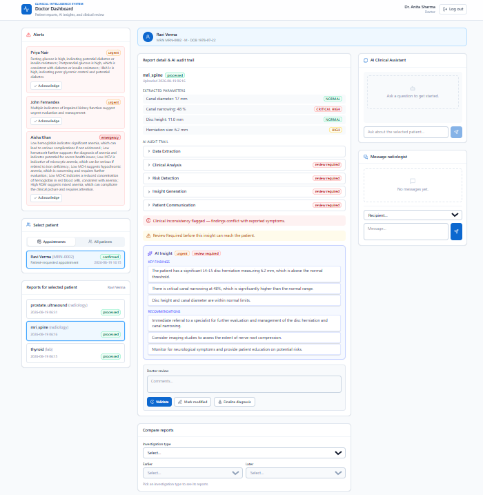
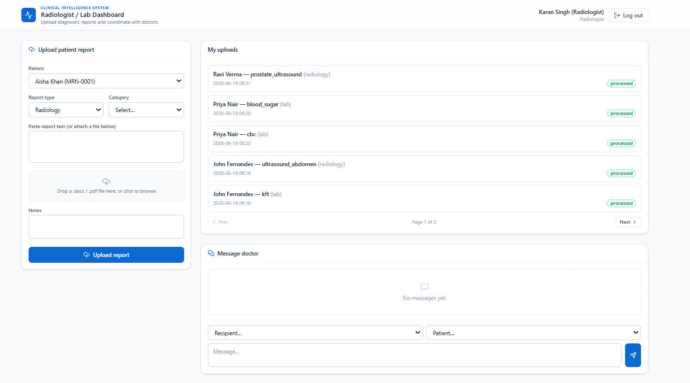

# Clinical Intelligence System


| | |
|---|---|
| **Full Name** | Ashish Jain |
| **Uplevel Email** | ashish.jain25@gmail.com |
| **Problem Statement** | Clinical Intelligence System (Healthcare — AI-Driven Multi-Role Clinical Intelligence System) |
| **Submission Date** | August 24, 2026 |

---

## 1. Problem Statement & Objective

**Business/domain problem.** Healthcare professionals spend significant time manually interpreting diagnostic reports (lab results, radiology reports, physician notes) and cross-referencing them against a patient's history. This slows down clinical decision-making and delays the moment a patient learns what their results mean. The original problem statement asked for an Agentic AI-powered diagnostic assistant that analyzes medical reports and patient history, detects abnormal patterns and clinical risk, and generates structured insights for clinicians.

**End users / key stakeholders.** Three distinct roles, each with a different need from the same underlying data:
- **Patients** — want a plain-language explanation of their results, not a raw lab report.
- **Doctors** — want AI-generated insights they can validate quickly, with full traceability into how the AI reached its conclusion, and to be alerted immediately when something is critical.
- **Radiologists / lab technicians** — the report source: they upload diagnostic reports and need to know when a doctor needs something from them.

**What success looks like.** A report uploaded by a radiologist/lab tech is automatically parsed, analyzed for clinical risk, and turned into both a clinician-facing insight and a patient-facing plain-language summary — but the patient-facing summary is never shown until a doctor has actually reviewed and approved it, and any critical finding immediately raises an alert on the doctor's dashboard rather than waiting to be discovered. Success is not just "the AI produces an answer" — it is that every AI judgment that could matter clinically is either corroborated deterministically or gated behind a human before it reaches a patient.

*(This project name is "Clinical Intelligence System" — the "Healthcare use case" problem statement from the capstone brief.)*

---

## 2. System Architecture & Design

### Architecture diagrams

All four diagrams below are generated from Mermaid sources in `app/docs/architecture-diagrams/*.mmd` (regenerate with `mmdc`, see the README); the full set of 12 diagrams (including per-flow sequence diagrams for login, alert escalation, doctor review, appointment booking/cancellation, and a deployment diagram) lives in `app/docs/architecture.pdf`. The AWS deployment specifically — rationale, setup, operations, and this live deployment's actual details — has its own diagrammed reference document, `app/docs/deployment-architecture.pdf`.

**System component diagram** — `app/docs/architecture-diagrams/diagram1-system.png`



The React SPA talks to the FastAPI backend exclusively through `/api/*` JSON (the static build itself is served as assets, not a separate origin). Inside the backend, role-scoped routers (`routes_auth`/`routes_patient`/`routes_doctor`/`routes_radiologist`) delegate to `auth/` (pbkdf2 + session cookie + RBAC) and `services/` (report, compare, chat, alert, appointment), which in turn call `db/repositories` (RBAC-scoped SQL, the source of truth) and `agents/` (the 5-agent clinical pipeline). The pipeline leans on `knowledge_graph.py` (a static NetworkX ontology) and the injectable `observability/` port. Everything outside the dashed box is an external dependency: ChromaDB (embeddings only — never relational data), local `uploads/`, the OpenAI API (`embed` + `complete`), optional Langfuse, and SQLite as the single relational source of truth.

**5-agent pipeline flow** — `app/docs/architecture-diagrams/diagram2-pipeline.png`



This traces one report from upload to patient visibility, with the three negative-scenario branch points drawn explicitly rather than left implicit: **Data Extraction** can short-circuit to `needs_review` on low confidence; **Clinical Analysis** can raise `clinical_inconsistency` when findings conflict with reported symptoms; **Risk Detection** can cross a critical threshold and fire an alert + escalation directly, in parallel with continuing on to **Insight Generation** and **Patient Communication**. The chain always terminates at the **Doctor review** decision point — only `validated`/`modified`/`finalized` makes the summary visible to the patient; anything still `pending` stays hidden. This is the same gate described in Section 2's Workflow & State Management above, drawn as a flow rather than as a state table.

**AI chat (RAG) sequence** — `app/docs/architecture-diagrams/seq7-ai-chat.png`



One chat turn end-to-end: the SPA posts the question to the role-appropriate router, which calls `chat_service.ask()`. That function persists the user's message first, then queries `ChromaStore` **twice** — `patient_reports` filtered by `patient_id`, then the unfiltered `reference_knowledge` collection — builds a combined context string from both result sets, calls `OpenAI.complete()` with a role-specific system prompt (patient vs. doctor wording), persists the assistant's reply together with the `retrieved_chunk_ids` it was grounded on, and returns the answer to the SPA. The per-patient filter at the ChromaDB query step — not a prompt instruction — is what actually prevents cross-patient data leakage (see Section 3, Vector Store configuration).

**Doctor ↔ radiologist messaging sequence** — `app/docs/architecture-diagrams/seq8-messaging.png`



`message_repo` derives a stable `thread_id` from `sorted(sender, recipient) + patient_id`, so the same conversation thread resolves identically regardless of who sends the first message — a doctor messaging a radiologist about patient #42 and that radiologist replying both land in the same thread. The recipient's dashboard then pulls the thread back with a simple per-patient `GET`, resolved against `users` for the sender's display name so the UI never shows a raw user ID (see Section 6, Interface features).

*Note for the Google Doc: paste these as actual inserted images (Insert → Image → Upload from computer) rather than relying on the relative Markdown paths above, which won't resolve once pasted into Docs.*

### Agent roles

Five agents run in a fixed chain for every uploaded report:

| # | Agent | Mandate |
|---|---|---|
| 1 | **Data Extraction** | Parses the raw report text (plus a table extract, for DOCX/PDF uploads), lists every clinically relevant parameter it can find with value/unit/reference range/status, lists narrative observations and anything missing or ambiguous, and produces an extraction-confidence score. |
| 2 | **Clinical Analysis** | Interprets the extracted parameters against clinical reference ranges (lab reports) or produces a structured radiology assessment (study type, findings, impression, differential diagnoses — for radiology reports), and checks whether findings align with the patient's reported symptoms. |
| 3 | **Risk Detection** | Assigns a severity/risk classification per finding, corroborated against a medical knowledge graph (allergen cross-reactivity, symptom→diagnosis, lab-category→diagnosis edges), and decides whether the case needs immediate clinical escalation. |
| 4 | **Insight Generation** | Consolidates the three upstream agents' outputs plus a summary of the patient's prior reports of the same category into key findings, risk indicators, recommendations, and a historical-comparison note — this agent was designed and built entirely from scratch. |
| 5 | **Patient Communication** | Converts the clinician-facing insight into a plain-language explanation for the patient, with an explicit rule against diagnostic-sounding language — this agent was also designed and built entirely from scratch. |

### Orchestration pattern: sequential chain, not parallel/consensus

The five agents are **strictly sequential** — each stage's input is the previous stage's structured output (Data Extraction → Clinical Analysis → Risk Detection → Insight Generation → Patient Communication), so there is a genuine data dependency, not an artificial ordering. This rules out parallel or consensus patterns, which fit independent sub-tasks being reconciled after the fact — that isn't this problem.

The orchestrator (`ClinicalPipeline.run`) is a **plain Python function**, not one large LangChain LCEL `RunnableSequence`, for three deliberate reasons:
1. Report-type branching (lab vs. radiology dispatches to a different Clinical Analysis sub-agent) is clearer as a Python `if` than as LCEL routing.
2. Every stage's output must be persisted to the audit trail immediately, even if a *later* stage throws — an LCEL chain that fails partway through would lose the earlier stages' results.
3. The negative-scenario / escalation logic (see Technical Implementation below) is deterministic business logic layered *around* each LLM call, not something that belongs inside the LLM chain itself.

Each individual agent, internally, *does* use LCEL (`prompt | ChatOpenAI | PydanticOutputParser`) — the sequencing is what stays outside of LangChain.

### Workflow & state management

State is explicit and auditable in SQLite, not implicit in agent memory:
- `pipeline_runs` — one row per upload, status `running → completed/failed`.
- `agent_outputs` — one row per agent per run, storing the full structured output plus a `flagged`/`flag_reason` pair for the audit trail.
- `insights.status` — `ai_generated → review_required → doctor_reviewed → finalized`.
- `patient_summaries.clinician_approved` — starts `false` for every single report, flipped only by an explicit doctor review action.

**Human-in-the-loop** is not optional in this design: a doctor's Validate/Modify/Finalize action is the only thing that can move an insight out of `review_required` and the only thing that can set `clinician_approved = true` — this is enforced at the database layer in `pipeline_repo.add_doctor_review`, independent of what any agent claimed about its own output. Two conditional-routing branches also fire mid-pipeline rather than at the end: a critical Risk Detection finding creates an `alerts` row and a naive next-business-day placeholder appointment in the same run, before Insight Generation even executes.

---

## 3. Technical Implementation

### Document processing pipeline

- **Ingestion**: `DocumentProcessor` parses `.docx` (via `python-docx`) and `.pdf` (via `pdfplumber`) into paragraphs, tables, and a flattened full-text string; plain pasted text is accepted directly. Tables are flattened separately into `table_text` so they can be fed to the LLM without losing row/column structure.
- **Deterministic pre-pass**: before any LLM call, a regex-based `EntityExtractor` runs against the full text — 12 lab-value patterns (Hemoglobin, WBC, RBC, Platelet, Glucose, Creatinine, BUN, Bilirubin, AST, ALT, TSH, Free T4), 4 status-keyword categories (normal/high/low/critical), and a ~20-term allergen dictionary spanning food/medication/environmental categories.
- **Metadata tagging (for retrieval)**: every report chunk pushed into the vector store is tagged with `patient_id`, `report_id`, `report_type`, `category`, and `report_date` — this is what makes retrieval filterable per patient later, not a separate tagging pass.

### Embedding model & vector store configuration

- **Embedding model**: OpenAI `text-embedding-3-small`.
- **Vector store**: ChromaDB, `PersistentClient`, **cosine** similarity (`hnsw:space: cosine`), two collections: `patient_reports` and `reference_knowledge`.
- **Chunking**: naive word-based chunking, **500 words per chunk with a 50-word overlap** — chosen to keep each chunk within a comfortable single-topic window for a diagnostic report while the overlap avoids splitting a finding's context across a chunk boundary.
- **Top-k rationale**: patient-report retrieval uses `n_results=5` (the primary grounding source, so it gets the larger share), reference-knowledge retrieval uses `n_results=3` (supplementary, kept small to bound prompt size) — retrieval on `patient_reports` is always `where={"patient_id": ...}`-filtered, which is the actual mechanism (not a prompt instruction) that prevents one patient's data from ever entering another patient's chat context.

### NER / domain-entity extraction approach

Two layers, deliberately:
1. **Deterministic regex layer** (`EntityExtractor`) — 100% precise on the lab-value/status/allergen patterns it targets, zero recall outside them. Cheap, and runs before any LLM call.
2. **LLM layer** (Data Extraction agent) — catches everything the regex pass can't (narrative findings, radiology impressions, anything phrased differently from the regex patterns). Any regex-found value the LLM doesn't surface is force-appended rather than silently dropped, so the deterministic pass acts as a recall floor, not just a hint.

Extracted entities are **typed** via Pydantic (`ExtractedParameter`: name/value/unit/reference_range/status) and **normalized** through a canonicalization layer (`normalize.py`) that maps free-text status/urgency/risk words the LLM emits (e.g. "Slightly High", "ABNORMAL", "Low-normal", "LOW (Stage 3 CKD)") onto the strict enum the schema requires — see the format-instructions drift issue under Challenges & Learnings.

### Prompt engineering strategy per agent

Each of the 5 agents has its own role-framed system prompt (e.g. "You are a clinical laboratory medicine specialist" / "an expert radiologist" / "a clinical risk assessment specialist"), with domain reference data embedded directly where it matters — hardcoded lab reference ranges and critical/panic-value thresholds in Clinical Analysis, an allergen cross-reactivity table in Risk Detection — plus an explicit "do not invent values" instruction, and every agent's output is constrained to a Pydantic schema via `PydanticOutputParser` (`prompt | ChatOpenAI | parser`), so the model literally cannot return unstructured free text where a typed field is expected.

### Error handling & recovery loops implemented

- **Malformed documents**: `DocumentProcessor.load_docx`/`load_pdf` catch parse exceptions, log, and return `None` — the caller falls back to an empty raw-text string rather than the upload crashing.
- **Empty/unusable documents**: Data Extraction short-circuits with a deterministic negative-scenario output (`needs_review=True`, confidence `0.0`) and **skips the LLM call entirely** when there is no extractable text at all (the real scanned-image PDF with no OCR layer in this project's own sample dataset triggers exactly this path).
- **LLM call failures**: every LLM invocation is wrapped in `TracedAgent.invoke_llm`, which logs the exception into the observability generation span (`end_generation(output={"error": ...})`) before re-raising.
- **Pipeline-level isolation**: `ClinicalPipeline.run` wraps the entire 5-agent chain in a single try/except — any unhandled exception marks the `pipeline_runs` row `failed` and the report `error`, so the UI shows a failed-processing state instead of a 500.
- **Deterministic safety nets (the actual closed-loop mechanism)**: on top of every agent's LLM output, hardcoded checks can override the model's own self-report — a `CRITICAL_LOW`/`CRITICAL_HIGH` finding forces escalation even if the LLM said otherwise; conflicting indicators or an urgent-but-symptom-misaligned finding force `clinical_inconsistency`; low confidence or an upstream escalation forces `review_required`. Every override is logged via `flagged`/`flag_reason` on the `agent_outputs` row, so it's auditable, not silent.

**Known gap** (see Challenges & Learnings): there is no retry/backoff loop for transient OpenAI errors or rate limits — a failed call currently fails the whole pipeline run rather than retrying.

---

## 4. Observability & Cost Design

### Langfuse trace setup

Observability is dependency-injected behind an `ObservabilityPort` interface — `NoOpObservability` is the default (the app runs fully offline without a Langfuse account), `LangfuseObservability` is used when Langfuse keys are configured. It targets the **current Langfuse v4 SDK**, which is OTel-based (`start_observation(as_type=...)` + `.update()`/`.end()`), a materially different API from Langfuse's legacy v2-style `.trace()`/`.generation()` calls.

**Span hierarchy** (one per report upload):
```
trace: "clinical-pipeline-run"  (session_id = report-{id})
 ├─ span: stage-data-extraction
 │   └─ generation: data_extraction   (model, input, structured output)
 ├─ span: stage-clinical-analysis
 │   └─ generation: clinical_analysis
 ├─ span: stage-risk-detection
 │   └─ generation: risk_detection
 ├─ span: stage-insight-generation
 │   └─ generation: insight_generation
 └─ span: stage-patient-communication
     └─ generation: patient_communication
```
Every `generation` span records the model name, the (truncated) input, and the full structured output — giving a complete request-level trace of exactly what each agent saw and returned.

### Model tiering, caching, and batching

**Honest scope note**: the current implementation uses a **single model tier** (`gpt-4o-mini`) across all 5 agents and the RAG chat, and does **not** implement response caching or batched embedding calls. This was a deliberate simplification given the project timeline — see "What I'd do differently" in Challenges & Learnings for the concrete tiering/caching plan I'd build next (a larger model specifically for Risk Detection's escalation judgment; a report-content-hash cache to skip redundant re-analysis).

### Cost-latency tradeoff rationale

With a single mini-tier model, the cost lever actually pulled was **call count**, not model selection:
- Exactly **5 chat completions + 1 embedding call** per report upload — no self-critique/reflection loops, no redundant re-querying.
- The deterministic regex/rule layers absorb work that never needs an LLM at all: entity pre-extraction, every safety-net override, and the empty-document short-circuit (which skips the Data Extraction LLM call completely rather than sending a blank document to the model).
- RAG retrieval is capped at `top_k=5`/`3` specifically to bound prompt size, rather than dumping a patient's entire report history into context on every chat turn.

---

## 5. Evaluation & Accuracy

### How output quality was evaluated

No labeled golden-pairs dataset was available for this capstone, so evaluation is **behavior-under-adversarial-mock testing** rather than output-quality scoring: each agent's negative-scenario/safety-net branch is unit-tested by mocking `invoke_llm` to return an output that *deliberately violates* a safety rule, then asserting the deterministic override still fires. For example: `RiskDetectionOutput` is mocked with `requires_immediate_escalation=False` on a `CRITICAL_LOW` hemoglobin finding, and the test asserts the pipeline forces escalation anyway — proving the guardrail holds even when the model itself gets the judgment wrong. One full mocked end-to-end pipeline test proves the branches **compose** correctly across all 5 agents in a single run: a critical finding forces escalation → creates an alert + a placeholder appointment → forces the insight into `review_required` → keeps the patient-facing summary locked (`clinician_approved = 0`), regardless of what any individual agent's mocked output claimed.

This is backed by real-file parsing tests (including the one genuinely scanned, OCR-less PDF in the sample dataset) and an end-to-end FastAPI `TestClient` smoke test (login for all 3 roles, RBAC 403 checks, a graceful 503 when no API key is configured). **87 tests total, none requiring network access or a real API key** — every LLM call is mocked or skipped.

### Hallucination mitigation strategy

- **Structural grounding**: every agent's output is constrained to a Pydantic schema (`PydanticOutputParser`), so the model can't drift into free-form prose where a typed field is expected.
- **Retrieval grounding**: both RAG chatbots are instructed to answer "ONLY from the provided context" and to say so explicitly when context is insufficient, rather than speculate; per-patient metadata filtering (not a prompt instruction) is what actually prevents cross-patient leakage.
- **Self-check on the highest-risk agent**: the Patient Communication agent's own output is scanned with a regex guard (`_DIAGNOSTIC_PHRASE_PATTERN`) for diagnostic-sounding language ("you have X", "you are diagnosed with...") and flags itself if it can't avoid it — on top of the DB-level `clinician_approved` gate that withholds the summary from the patient regardless.
- **Confidence gates are load-bearing, not advisory**: `extraction_confidence`, `analysis_confidence`, `risk_confidence`, and `overall_confidence` at each stage feed directly into the deterministic `review_required` trigger.

### Key results, observations, and limitations found

- No formal precision/recall numbers were computed — there was no labeled ground-truth clinical dataset for this project, which is itself a documented limitation.
- The two-layer NER (regex-first, LLM-fills-gaps) is a deliberate precision/recall tradeoff: the regex layer is 100% precise on its ~12 targeted lab-value patterns but has zero recall outside them; the LLM layer covers everything else.
- The most significant real accuracy gap found was **not** a model-hallucination issue but a **business-logic bug**, caught during manual verification rather than by an automated test — see Challenges & Learnings.

---

## 6. Deployment & UI

### FastAPI endpoint design and testing

Role-scoped routers (`routes_auth`, `routes_patient`, `routes_doctor`, `routes_radiologist`, `routes_pages`) sit behind a **single process-lifetime object graph** built once in `main.py`'s `lifespan` — `ChromaStore`, `MedicalKnowledgeGraph`, `OpenAIClient`, the `ObservabilityPort`, and the `ClinicalPipeline` are all constructed at startup, stored on `app.state`, and injected into request handlers via FastAPI `Depends`. Tested with FastAPI's `TestClient`: login for all 3 roles, RBAC 403 checks, and a real `/healthz` that executes `SELECT 1` against SQLite rather than returning an unconditional 200 — an unmounted data volume (the most likely real deployment failure) fails the health check instead of lying about liveness.

### Secrets and configuration externalization

`pydantic-settings` `BaseSettings` reads typed config from `.env` (`OPENAI_API_KEY`, optional `LANGFUSE_*` keys, `DATABASE_PATH`, confidence thresholds, `SESSION_SECRET`). A missing `OPENAI_API_KEY` gates every AI-calling endpoint with a graceful `503` rather than crashing the app on startup — the rest of the app (auth, dashboards, history, appointments) works with no key configured at all. In the AWS deployment, the same variables are populated at container boot from **SSM Parameter Store `SecureString`s**, never baked into the Docker image.

### Interface features

The interface is **not Gradio** — the PDF's own tech-stack table marks it "indicative" — it's a **React + TypeScript SPA** (Vite, Tailwind, React Router, TanStack Query) talking to the backend purely through `/api/*` JSON. This was chosen because the actual requirement was **three genuinely distinct, role-scoped dashboards** sharing components, which maps far more naturally onto real client-side routing than a single Gradio Blocks app. Features actually built:
- File upload (drag/drop **or pasted text**) with a fixed, grouped category dropdown.
- Tabbed/paneled results per role: report list/detail/compare, the full 5-agent audit trail rendered as structured per-agent findings (not raw JSON), and doctor review history.
- Two embedded RAG chatbots — "AI Health Assistant" (patient) and "AI Clinical Assistant" (doctor).
- In-app doctor↔radiologist messaging (recipient picked from a name directory, never a raw user ID).
- Appointment booking against a live free/busy slot grid, with self-cancellation.
- A critical-alerts panel, click-through to the triggering patient.

**Patient dashboard** — report upload, medical history/allergies, Book appointment panel (with live upcoming appointments), and the AI Health Assistant chat panel:



**Doctor dashboard** — Alerts panel, patient selector, report detail with the 5-agent AI audit trail expanded (each agent's `review required` status visible per-stage), the AI Insight card, the Validate/Modify/Finalize review form, AI Clinical Assistant, and Message radiologist panel:



**Radiologist / Lab dashboard** — Upload patient report panel (patient/report-type/category selection, file drop or pasted text), My uploads list with processing status, and Message doctor panel:




---

## 7. Challenges & Learnings

### Top challenges encountered and how they were resolved

**1. An LLM-schema-drift bug that silently broke the whole pipeline.** Despite `format_instructions` explicitly listing the allowed status values (`NORMAL`/`LOW`/`HIGH`/`CRITICAL_LOW`/`CRITICAL_HIGH`/`UNKNOWN`), `gpt-4o-mini` reliably drifted to synonyms on real clinical report text — `"Slightly High"`, `"ABNORMAL"`, `"Low-normal"`, `"Prolonged"`, `"Positive"`, `"LOW (Stage 3 CKD)"` — which made `PydanticOutputParser` raise `OutputParserException` and fail the entire pipeline stage. **Resolution**: a normalization layer (`normalize.py`) applied as a Pydantic `field_validator(mode="before")` coerces close-enough LLM answers into a valid enum value instead of hard-failing. The mapping deliberately errs toward flagging (`LOW`/`HIGH` over `NORMAL`) when a qualifier is ambiguous, and toward `UNKNOWN` — never a guessed direction — when there's no real signal, consistent with the project's safety-first bias (plain `LOW`/`HIGH` never triggers escalation on its own; only `CRITICAL_*` does, via the deterministic checks described in Section 3).

**2. A multi-signal alert classifier picking the wrong "reason."** A patient's on-file peanut allergy caused her *unrelated* critical Troponin I lab alert to be mislabeled `"allergy_risk"` instead of `"critical_lab"` — found during manual end-to-end verification, not by an automated test. Root cause: the alert-typing logic looked at *any* risk flag with a cross-reactive allergen present anywhere in the Risk Detection output, rather than only the flags that actually crossed a critical threshold. **Resolution**: filter to `critical_flags` first, and derive both the alert message and its type only from that filtered set. **Lesson**: a multi-signal classifier needs to reason about which signal is *the reason* for an alert, not merely whether a signal exists anywhere in the output — this class of bug won't show up in a single-scenario unit test, only in an end-to-end run with a realistically multi-faceted patient.

**3. A Windows environment footgun.** On a machine with multiple Python versions installed, plain `python -m venv .venv` silently created the virtual environment against a stray Python 3.14 install ahead of 3.13 on `PATH`, producing a cryptic `ModuleNotFoundError: No module named 'pydantic_core._pydantic_core'` at import time — a compiled-extension/interpreter mismatch, not an actually-missing dependency. **Resolution**: pin the interpreter explicitly (`py -3.13 -m venv .venv`) and document the `.venv\pyvenv.cfg` / `where uvicorn` verification steps so it wouldn't silently recur for future setup.

**4. A first real AWS deploy surfaced five latent bugs that no local dev run or the 87-test suite had ever exercised.** Standing the app up on actual EC2 infrastructure hits code paths — real cloud service limits, a genuinely time-ordered secrets lifecycle, real request-signing — that `uvicorn --reload` and mocked-LLM tests never touch:
- **Terraform**: an SSM `SecureString` parameter can't hold an empty string, but the optional Langfuse placeholders used `value = ""`. Fixed with a `"UNSET"` sentinel — which would in turn have been *truthy* and crashed the whole app at boot (via Langfuse's eager `auth_check()`) had `config.py`'s `langfuse_configured`/`openai_configured` properties not been made sentinel-aware at the same time.
- **Terraform**: the security group's description contained an em dash; AWS security group descriptions are ASCII-only.
- **Terraform**: the current Amazon Linux 2023 AMI's root snapshot needs ≥30GB, but the stack hardcoded a 15GB root volume — a limit that only exists on AWS's side and isn't visible from the Terraform config in isolation.
- **Deployment ordering, not a code bug**: `bootstrap.sh` writes `/opt/app/.env` from SSM exactly once, at first boot. Real secrets set in SSM *after* that point never reach the running container until `.env` is explicitly re-fetched and the container recreated — updating a parameter store is not the same as updating a file already written to disk, and the app briefly ran in production with a placeholder `OPENAI_API_KEY`.
- **Frontend**: `UploadReportForm`'s selected-patient state was seeded once from an async-loaded patients list; when the form mounted before that list resolved, the dropdown *looked* selected (a browser fallback for a controlled value matching no option) while silently submitting an empty `patient_id`. This surfaced in the browser as a raw `[object Object]` toast, because the API client only handled `HTTPException`-style string error details, not FastAPI's own list-shaped automatic validation-error responses.

**Resolution**: each was root-caused against the live instance (SSM command output, direct `curl` reproduction with an empty field, reading the installed AWS SDK's source to trace a `SignatureDoesNotMatch` down to a global-vs-regional endpoint mismatch in presigned-URL generation used for data seeding) rather than guessed at. **Lesson**: none of these are model or prompt bugs — they live at the boundary between "code that passes tests" and "infrastructure, timing, and serialization that are actually real," and a fully green test suite says nothing about that boundary.

### What I would do differently given more time or resources

- Add retry/backoff for transient OpenAI errors and rate limits — currently a failed LLM call fails the entire pipeline run rather than retrying with backoff.
- Introduce real model tiering (e.g., a stronger model specifically for Risk Detection's escalation judgment, `gpt-4o-mini` for the rest) and a report-content-hash response cache to avoid redundant calls on re-analysis.
- Build a small labeled evaluation set (golden pairs) to get real precision/recall numbers, rather than relying solely on behavior-under-adversarial-mock test coverage.
- Add an OCR fallback for scanned-image reports instead of only flagging them for review — currently a correct, honest limitation, but a genuinely addressable one.
- Add HTTPS via a Caddy reverse-proxy once a custom domain is pointed at the instance — the live deployment currently serves plain HTTP on AWS's own free public DNS hostname, which is documented but not yet done.
- Narrow the AWS credentials used for deployment/admin operations from the account's root access key to a scoped IAM user (least-privilege, matching what the CI pipeline's own IAM user already does).
- Add an explicit "refresh secrets on the instance" step (or automate it) immediately after `terraform apply`, rather than relying on remembering that `bootstrap.sh` only reads SSM once, at first boot.

### Key insight gained

The most safety-critical part of a multi-agent clinical pipeline turned out not to be the prompts — it's the **deterministic code wrapped around them**. Every one of the negative-scenario rows in the original problem statement (low-confidence extraction, clinical inconsistency, escalation, review-required, clinician oversight) ended up implemented as a hardcoded check that runs *after* the LLM call and does not trust the model's own self-report. The clinician-approval gate for patient-facing summaries is enforced at the **database level** (`patient_summaries.clinician_approved`), completely independent of anything the Patient Communication agent claims about itself — that separation is what actually makes the system trustworthy, not the quality of any single prompt.

---

## 8. Unique Enhancements (Bonus)

Beyond the core requirements and the PDF's own indicative scope, the following substantive features were built:

**1. A real production deployment pipeline — and actually deployed, not just scripted.** Beyond the indicative deployment approach in the original problem statement, this project ships a multi-stage Dockerfile (Node frontend build stage → Python runtime stage), a Terraform stack provisioning a single EC2 instance + persistent EBS data volume + ECR repository + IAM role + SSM-managed secrets on AWS, and a GitHub Actions CI/CD workflow (test → build → push to ECR → SSM-triggered redeploy on the instance, no SSH key required). This is an actual internet-reachable, restart-durable production deployment with a documented backup/HTTPS/scaling story — and it is genuinely live: **http://ec2-63-185-251-88.eu-central-1.compute.amazonaws.com** (AWS eu-central-1), seeded with 2 doctors, 2 radiologists, and 5 patients whose reports have run through the real 5-agent pipeline (password `password123` for every seeded account). See `app/docs/deployment-architecture.pdf` for the deployment diagram and this deployment's specifics, and Section 7 below for the real infrastructure bugs that only a first actual deploy surfaces.

**2. Two entirely new agents with no precedent in the provided reference materials.** Those reference materials covered only 3 of the 5 required pipeline stages. **Insight Generation** and **Patient Communication** were designed and built from scratch, including the DB-level clinician-approval gate architecture that makes the patient-facing agent's output provably safe regardless of what it claims about itself — an independent design decision, not an adaptation.

**3. Patient can book and cancel an appointment with a doctor for a specific date and time.** The original process flow describes only an "alert and appointment system trigger" step — a one-way, AI-initiated placeholder, not something a patient can act on. This project adds a full patient-facing self-service booking flow: real computed free/busy slots against a fixed clinic-hours grid (10:00–13:00 / 16:00–19:00, 15-minute slots), live conflict checking against the doctor's existing bookings, and self-cancellation from the same panel — alongside (not instead of) the AI-escalation path's automatic placeholder appointment.

**4. In-app doctor↔radiologist messaging.** A genuine collaboration feature (name-directory-based recipient selection, not raw user IDs) that has no agent or backend counterpart in the original process-flow diagram — the source PDF only implies collaboration generically ("Dashboard, chatbot & collaboration tools").

**5. A lightweight custom evaluation framework for safety-net behavior.** Rather than (or in addition to) output-quality scoring, the test suite is purpose-built to prove that every deterministic safety override still fires **even when the LLM is deliberately mocked to get the judgment wrong** — 87 tests total, including one full mocked pipeline run that proves all five negative-scenario branches compose correctly together in a single request.

**6. A React + TypeScript frontend built from scratch, not the indicative Gradio stack.** The PDF's own tech-stack table names Gradio as the (indicative) frontend. This project instead ships a full React SPA (Vite, Tailwind, React Router, TanStack Query) with three independently-routed role dashboards built from ~20 shared components (report upload/list/compare/detail, the 5-agent audit trail renderer, review history, chat panels, appointment/messaging panels), talking to the backend exclusively through a JSON API contract rather than server-rendered Gradio Blocks. This is a materially larger scope than a UI styling choice — it's a different client architecture, with its own routing, data-fetching/caching layer, and production build pipeline (see Section 6).

**7. A formal architecture design document with full sequence-diagram coverage — plus a second one for deployment.** Beyond the conceptual mockup-level diagrams in the original problem statement, this project produced 12 Mermaid-sourced diagrams — a system component diagram, the 5-agent pipeline flow, a role/actor diagram, a deployment diagram, and **8 request-level sequence diagrams** covering every major flow (login, upload → pipeline, critical-alert escalation, doctor review → patient reveal, appointment booking, appointment cancellation, AI chat, and doctor↔radiologist messaging) — each kept as a `.mmd` source under version control for reproducibility and rendered to an A4-landscape PDF (`docs/architecture.pdf`) for readability. Four of these are reproduced with commentary in Section 2 above. The deployment diagram and rationale are additionally expanded into their own standalone document, `docs/deployment-architecture.pdf`, with this specific live deployment's actual details (URL, region, instance, ECR repo, seed data).

---

*Prepared for the PwC × Agentic AI Capstone submission.*
