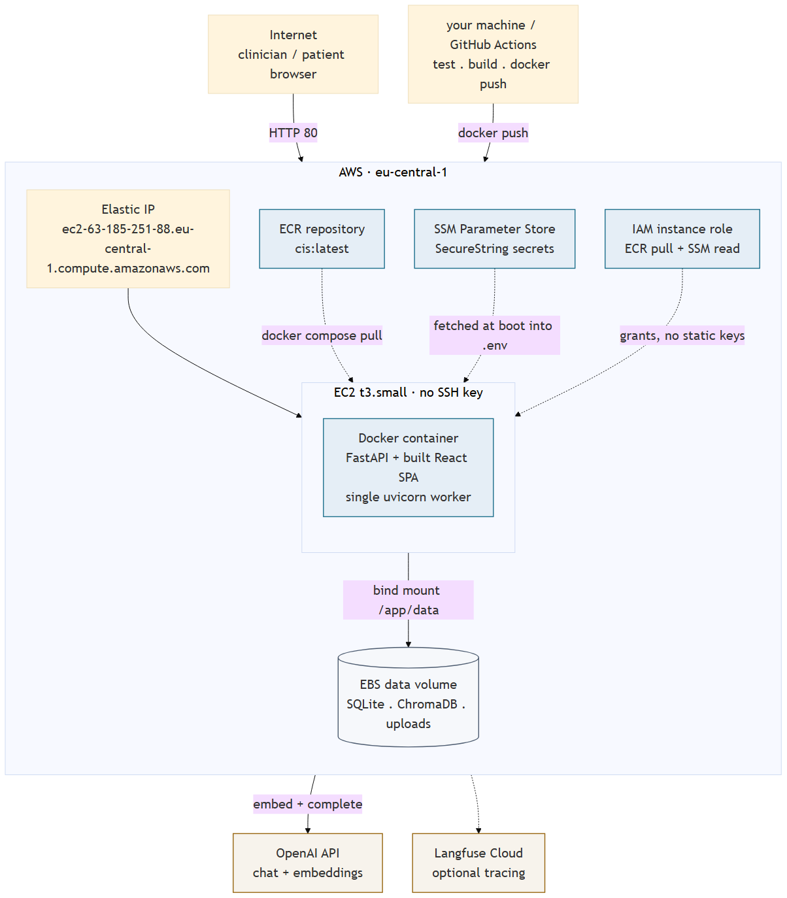

  
05<h2>Deployment</h2>

  

    Sections 01&ndash;04 cover what the system is made of and how a request
    moves through it. This system also runs live &mdash; one EC2 instance,
    one Docker container, one persistent EBS volume, provisioned by
    Terraform and deployed by GitHub Actions, with secrets in SSM Parameter
    Store and no SSH key on the box.
  

  

    
    LIVE &mdash; http://ec2-63-185-251-88.eu-central-1.compute.amazonaws.com
  

  

    The full deployment write-up &mdash; rationale, first-time setup, CI/CD,
    operations, and this specific deployment's details &mdash; is its own
    document: <code>docs/deployment-architecture.pdf</code>.
  

  
05<h2>Deployment diagram</h2>

  

